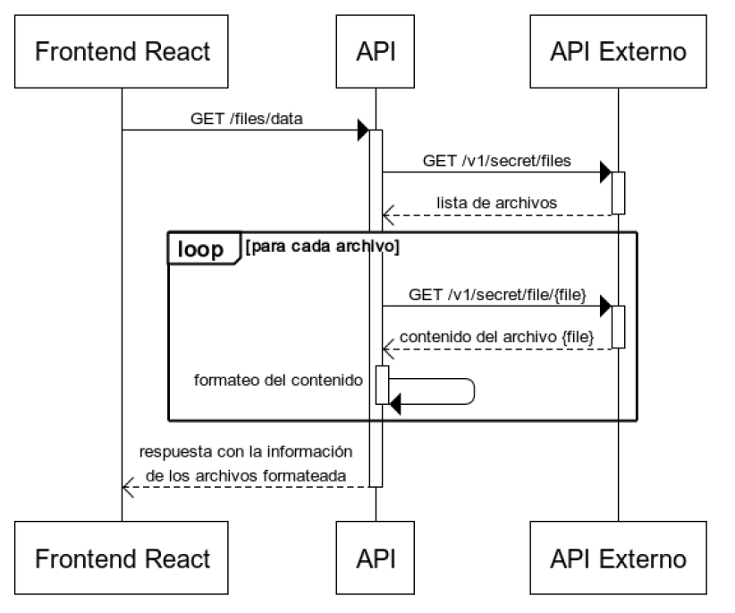

# Full Stack JS - Code Challenge

## ¿Qué tomamos en cuenta al revisar el challenge?

- El código entregado tiene que funcionar y cumplir con todo lo solicitado.
- Las instrucciones y la documentación deben ser prolijas y claras.
- Debe cumplir con los requisitos técnicos solicitados (incluir las librerías/frameworks especificados, versiones pedidas, tests indicados, instrucciones para correrlo, documentación, etc.).
- En caso de no entregarse o de no cumplir lo esperado, los puntos opcionales no influyen en la evaluación que haremos. Pero suman mucho para nosotros en caso de estar bien.

## ¿Qué hacer si tengo dudas sobre algo de lo pedido?

Ponte en contacto con la persona que te envió este challenge. Es preferible aclarar las dudas antes de enviar un resultado incorrecto o incompleto. Las consultas también nos ayudan como retroalimentación para mejorar las consignas.

## ¿Cómo envío el challenge?

Debes dejar tu código en un repo git público (o uno al cual podamos acceder) y luego enviarle la información a la persona que te envió este examen (URL y datos de acceso).

Una vez enviado el acceso, **no deberás realizar ningún cambio en el repo.** La evaluación puede comenzar en cualquier momento desde que recibimos los accesos.

---

## Challenge

Este challenge te pide desarrollar un frontend que consumirá datos de un API que también deberás desarrollar. El frontend deberá mostrar la información obtenida respetando las pautas que se describirán más abajo. Asimismo la API también debe ser desarrollada siguiendo requisitos explícitos.

### El API Externo

El API externo está documentado en el Swagger: [https://echo-serv.tbxnet.com/explorer/#/Secret](https://echo-serv.tbxnet.com/explorer/#/Secret)

API Key: `Bearer aSuperSecretKey`

**Métodos importantes:**

- Listado de archivos:
```bash
curl -X GET https://echo-serv.tbxnet.com/v1/secret/files \
-H 'authorization: Bearer aSuperSecretKey'
```
- Descarga de archivo:
```bash
curl -X GET https://echo-serv.tbxnet.com/v1/secret/file/file1.csv \
-H 'authorization: Bearer aSuperSecretKey'
```

Formato CSV esperado:
```csv
file,text,number,hex
file1.csv,RgTya,64075909,70ad29aacf0b690b0467fe2b2767f765
file1.csv,AtjW,6,d33a8ca5d36d3106219f66f939774cf5
```

### Diagrama de flujo




El diagrama en la página 2 muestra:
1. React frontend hace `GET /files/data` al API propio
2. Este API llama `GET /v1/secret/files` al API externo
3. Por cada archivo, hace `GET /v1/secret/file/{file}`
4. Formatea y responde con JSON consolidado al frontend

---

## 1. API - NodeJS + Express

### Endpoint
```http
GET /files/data
```

Debe:
- Obtener listado de archivos
- Descargar cada archivo
- Ignorar archivos vacíos o con líneas con errores (mal formateadas)
- Formatear correctamente los válidos

### Respuesta esperada:
```json
[
  {
    "file": "file1.csv",
    "lines": [
      {
        "text": "RgTya",
        "number": 64075909,
        "hex": "70ad29aacf0b690b0467fe2b2767f765"
      }
    ]
  }
]
```

### Tecnologías requeridas
- NodeJS 14
- JavaScript (ES6+)
- No usar: TypeScript, Babel, Elm, Dart, etc.

### Librerías sugeridas
- ExpressJs
- Mocha + Chai para tests (`npm test`)

---

## 2. Frontend - React + Bootstrap

Debe consumir `GET /files/data` del API creado y mostrarlo de forma ordenada.

### Wireframe (página 6)
- Cabecera: "React Test App"
- Tabla con columnas: File Name, Text, Number, Hex

### Requisitos
- NodeJS 16
- React + React Bootstrap
- Programación funcional + hooks
- No usar TypeScript, Dart, Elm, etc.

---

## 3. Puntos opcionales

### Para el API
- `GET /files/list` para listar archivos (igual que API externa)
- Filtro por `fileName`: `/files/data?fileName=<archivo>`
- Usar StandardJS

### Para el Frontend
- Usar Redux
- Tests unitarios con Jest
- Filtro por `fileName`

### Global
- Usar Docker o Docker Compose para correr ambas apps

---

# ENGLISH VERSION

## Full Stack JS - Code Challenge

### What we consider during the review:
- The delivered code must run and fulfill all requirements.
- Instructions and documentation must be neat and clear.
- Must meet the technical requirements specified.
- Optional points won’t help if basic requirements aren't met, but add value when fulfilled.

### If you have questions
Contact the person who sent you the challenge before delivering an incorrect or incomplete result.

### How to submit it
Push your code to a public (or accessible) Git repository and send the link. **Do not modify it after submission.**

---

## Challenge
Build a **frontend** that consumes an **API** (both built by you). The external API is provided.

### External API
Swagger: [https://echo-serv.tbxnet.com/explorer/#/Secret](https://echo-serv.tbxnet.com/explorer/#/Secret)

API Key: `Bearer aSuperSecretKey`

#### Methods:
- List files:
```bash
curl -X GET https://echo-serv.tbxnet.com/v1/secret/files \
-H 'authorization: Bearer aSuperSecretKey'
```
- Get file:
```bash
curl -X GET https://echo-serv.tbxnet.com/v1/secret/file/file1.csv \
-H 'authorization: Bearer aSuperSecretKey'
```

CSV format:
```csv
file,text,number,hex
file1.csv,RgTya,64075909,70ad29aacf0b690b0467fe2b2767f765
```

### Sequence Diagram


- React calls `/files/data`
- Backend calls `/v1/secret/files`
- Then calls each `/v1/secret/file/{file}`
- Returns JSON formatted response

---

## 1. API - NodeJS + Express

### Endpoint
```http
GET /files/data
```

Must:
- Get files list
- Download each file
- Skip empty or invalid lines/files
- Return valid entries formatted in JSON

### Example response:
```json
[
  {
    "file": "file1.csv",
    "lines": [
      {
        "text": "RgTya",
        "number": 64075909,
        "hex": "70ad29aacf0b690b0467fe2b2767f765"
      }
    ]
  }
]
```

### Requirements
- NodeJS 14
- JavaScript (ES6+)
- Do not use TypeScript, Babel, etc.

### Libraries
- ExpressJs
- Mocha + Chai (unit tests)

---

## 2. Frontend - React + Bootstrap

Should render `/files/data` response.

### Layout
- Title: "React Test App"
- Table: File Name | Text | Number | Hex

### Requirements
- NodeJS 16
- Functional components + hooks
- JavaScript (ES6+)
- No TypeScript or similar

---

## 3. Optional points

### API
- Add `GET /files/list`
- Filter support: `/files/data?fileName=<file>`
- Use StandardJS

### Frontend
- Use Redux
- Unit tests with Jest
- Filter using fileName

### Global
- Docker or Docker Compose support for both apps

# Full Stack JS - Code Challenge

## ¿Qué tomamos en cuenta al revisar el challenge?

- El código entregado tiene que funcionar y cumplir con todo lo solicitado.
- Las instrucciones y la documentación deben ser prolijas y claras.
- Debe cumplir con los requisitos técnicos solicitados (incluir las librerías/frameworks especificados, versiones pedidas, tests indicados, instrucciones para correrlo, documentación, etc.).
- En caso de no entregarse o de no cumplir lo esperado, los puntos opcionales no influyen en la evaluación que haremos. Pero suman mucho para nosotros en caso de estar bien.

## ¿Qué hacer si tengo dudas sobre algo de lo pedido?

Ponte en contacto con la persona que te envió este challenge. Es preferible aclarar las dudas antes de enviar un resultado incorrecto o incompleto. Las consultas también nos ayudan como retroalimentación para mejorar las consignas.

## ¿Cómo envío el challenge?

Debes dejar tu código en un repo git público (o uno al cual podamos acceder) y luego enviarle la información a la persona que te envió este examen (URL y datos de acceso).

Una vez enviado el acceso, **no deberás realizar ningún cambio en el repo.** La evaluación puede comenzar en cualquier momento desde que recibimos los accesos.

---

## Challenge

Este challenge te pide desarrollar un frontend que consumirá datos de un API que también deberás desarrollar. El frontend deberá mostrar la información obtenida respetando las pautas que se describirán más abajo. Asimismo la API también debe ser desarrollada siguiendo requisitos explícitos.

### El API Externo

El API externo está documentado en el Swagger: [https://echo-serv.tbxnet.com/explorer/#/Secret](https://echo-serv.tbxnet.com/explorer/#/Secret)

API Key: `Bearer aSuperSecretKey`

**Métodos importantes:**

- Listado de archivos:
```bash
curl -X GET https://echo-serv.tbxnet.com/v1/secret/files \
-H 'authorization: Bearer aSuperSecretKey'
```
- Descarga de archivo:
```bash
curl -X GET https://echo-serv.tbxnet.com/v1/secret/file/file1.csv \
-H 'authorization: Bearer aSuperSecretKey'
```

Formato CSV esperado:
```csv
file,text,number,hex
file1.csv,RgTya,64075909,70ad29aacf0b690b0467fe2b2767f765
file1.csv,AtjW,6,d33a8ca5d36d3106219f66f939774cf5
```

### Diagrama de flujo


El diagrama en la página 2 muestra:
1. React frontend hace `GET /files/data` al API propio
2. Este API llama `GET /v1/secret/files` al API externo
3. Por cada archivo, hace `GET /v1/secret/file/{file}`
4. Formatea y responde con JSON consolidado al frontend

---

## 1. API - NodeJS + Express

### Endpoint
```http
GET /files/data
```

Debe:
- Obtener listado de archivos
- Descargar cada archivo
- Ignorar archivos vacíos o con líneas con errores (mal formateadas)
- Formatear correctamente los válidos

### Respuesta esperada:
```json
[
  {
    "file": "file1.csv",
    "lines": [
      {
        "text": "RgTya",
        "number": 64075909,
        "hex": "70ad29aacf0b690b0467fe2b2767f765"
      }
    ]
  }
]
```

### Tecnologías requeridas
- NodeJS 14
- JavaScript (ES6+)
- No usar: TypeScript, Babel, Elm, Dart, etc.

### Librerías sugeridas
- ExpressJs
- Mocha + Chai para tests (`npm test`)

---

## 2. Frontend - React + Bootstrap

Debe consumir `GET /files/data` del API creado y mostrarlo de forma ordenada.

### Wireframe (página 6)
- Cabecera: "React Test App"
- Tabla con columnas: File Name, Text, Number, Hex

### Requisitos
- NodeJS 16
- React + React Bootstrap
- Programación funcional + hooks
- No usar TypeScript, Dart, Elm, etc.

---

## 3. Puntos opcionales

### Para el API
- `GET /files/list` para listar archivos (igual que API externa)
- Filtro por `fileName`: `/files/data?fileName=<archivo>`
- Usar StandardJS

### Para el Frontend
- Usar Redux
- Tests unitarios con Jest
- Filtro por `fileName`

### Global
- Usar Docker o Docker Compose para correr ambas apps

---

# ENGLISH VERSION

## Full Stack JS - Code Challenge

### What we consider during the review:
- The delivered code must run and fulfill all requirements.
- Instructions and documentation must be neat and clear.
- Must meet the technical requirements specified.
- Optional points won’t help if basic requirements aren't met, but add value when fulfilled.

### If you have questions
Contact the person who sent you the challenge before delivering an incorrect or incomplete result.

### How to submit it
Push your code to a public (or accessible) Git repository and send the link. **Do not modify it after submission.**

---

## Challenge
Build a **frontend** that consumes an **API** (both built by you). The external API is provided.

### External API
Swagger: [https://echo-serv.tbxnet.com/explorer/#/Secret](https://echo-serv.tbxnet.com/explorer/#/Secret)

API Key: `Bearer aSuperSecretKey`

#### Methods:
- List files:
```bash
curl -X GET https://echo-serv.tbxnet.com/v1/secret/files \
-H 'authorization: Bearer aSuperSecretKey'
```
- Get file:
```bash
curl -X GET https://echo-serv.tbxnet.com/v1/secret/file/file1.csv \
-H 'authorization: Bearer aSuperSecretKey'
```

CSV format:
```csv
file,text,number,hex
file1.csv,RgTya,64075909,70ad29aacf0b690b0467fe2b2767f765
```

### Sequence Diagram


- React calls `/files/data`
- Backend calls `/v1/secret/files`
- Then calls each `/v1/secret/file/{file}`
- Returns JSON formatted response

---

## 1. API - NodeJS + Express

### Endpoint
```http
GET /files/data
```

Must:
- Get files list
- Download each file
- Skip empty or invalid lines/files
- Return valid entries formatted in JSON

### Example response:
```json
[
  {
    "file": "file1.csv",
    "lines": [
      {
        "text": "RgTya",
        "number": 64075909,
        "hex": "70ad29aacf0b690b0467fe2b2767f765"
      }
    ]
  }
]
```

### Requirements
- NodeJS 14
- JavaScript (ES6+)
- Do not use TypeScript, Babel, etc.

### Libraries
- ExpressJs
- Mocha + Chai (unit tests)

---

## 2. Frontend - React + Bootstrap

Should render `/files/data` response.

### Layout
- Title: "React Test App"
- Table: File Name | Text | Number | Hex

### Requirements
- NodeJS 16
- Functional components + hooks
- JavaScript (ES6+)
- No TypeScript or similar

---

## 3. Optional points

### API
- Add `GET /files/list`
- Filter support: `/files/data?fileName=<file>`
- Use StandardJS

### Frontend
- Use Redux
- Unit tests with Jest
- Filter using fileName

### Global
- Docker or Docker Compose support for both apps

# Full Stack JS - Code Challenge

## ¿Qué tomamos en cuenta al revisar el challenge?

- El código entregado tiene que funcionar y cumplir con todo lo solicitado.
- Las instrucciones y la documentación deben ser prolijas y claras.
- Debe cumplir con los requisitos técnicos solicitados (incluir las librerías/frameworks especificados, versiones pedidas, tests indicados, instrucciones para correrlo, documentación, etc.).
- En caso de no entregarse o de no cumplir lo esperado, los puntos opcionales no influyen en la evaluación que haremos. Pero suman mucho para nosotros en caso de estar bien.

## ¿Qué hacer si tengo dudas sobre algo de lo pedido?

Ponte en contacto con la persona que te envió este challenge. Es preferible aclarar las dudas antes de enviar un resultado incorrecto o incompleto. Las consultas también nos ayudan como retroalimentación para mejorar las consignas.

## ¿Cómo envío el challenge?

Debes dejar tu código en un repo git público (o uno al cual podamos acceder) y luego enviarle la información a la persona que te envió este examen (URL y datos de acceso).

Una vez enviado el acceso, **no deberás realizar ningún cambio en el repo.** La evaluación puede comenzar en cualquier momento desde que recibimos los accesos.

---

## Challenge

Este challenge te pide desarrollar un frontend que consumirá datos de un API que también deberás desarrollar. El frontend deberá mostrar la información obtenida respetando las pautas que se describirán más abajo. Asimismo la API también debe ser desarrollada siguiendo requisitos explícitos.

### El API Externo

El API externo está documentado en el Swagger: [https://echo-serv.tbxnet.com/explorer/#/Secret](https://echo-serv.tbxnet.com/explorer/#/Secret)

API Key: `Bearer aSuperSecretKey`

**Métodos importantes:**

- Listado de archivos:
```bash
curl -X GET https://echo-serv.tbxnet.com/v1/secret/files \
-H 'authorization: Bearer aSuperSecretKey'
```
- Descarga de archivo:
```bash
curl -X GET https://echo-serv.tbxnet.com/v1/secret/file/file1.csv \
-H 'authorization: Bearer aSuperSecretKey'
```

Formato CSV esperado:
```csv
file,text,number,hex
file1.csv,RgTya,64075909,70ad29aacf0b690b0467fe2b2767f765
file1.csv,AtjW,6,d33a8ca5d36d3106219f66f939774cf5
```

### Diagrama de flujo


El diagrama en la página 2 muestra:
1. React frontend hace `GET /files/data` al API propio
2. Este API llama `GET /v1/secret/files` al API externo
3. Por cada archivo, hace `GET /v1/secret/file/{file}`
4. Formatea y responde con JSON consolidado al frontend

---

## 1. API - NodeJS + Express

### Endpoint
```http
GET /files/data
```

Debe:
- Obtener listado de archivos
- Descargar cada archivo
- Ignorar archivos vacíos o con líneas con errores (mal formateadas)
- Formatear correctamente los válidos

### Respuesta esperada:
```json
[
  {
    "file": "file1.csv",
    "lines": [
      {
        "text": "RgTya",
        "number": 64075909,
        "hex": "70ad29aacf0b690b0467fe2b2767f765"
      }
    ]
  }
]
```

### Tecnologías requeridas
- NodeJS 14
- JavaScript (ES6+)
- No usar: TypeScript, Babel, Elm, Dart, etc.

### Librerías sugeridas
- ExpressJs
- Mocha + Chai para tests (`npm test`)

---

## 2. Frontend - React + Bootstrap

Debe consumir `GET /files/data` del API creado y mostrarlo de forma ordenada.

### Wireframe (página 6)
- Cabecera: "React Test App"
- Tabla con columnas: File Name, Text, Number, Hex

### Requisitos
- NodeJS 16
- React + React Bootstrap
- Programación funcional + hooks
- No usar TypeScript, Dart, Elm, etc.

---

## 3. Puntos opcionales

### Para el API
- `GET /files/list` para listar archivos (igual que API externa)
- Filtro por `fileName`: `/files/data?fileName=<archivo>`
- Usar StandardJS

### Para el Frontend
- Usar Redux
- Tests unitarios con Jest
- Filtro por `fileName`

### Global
- Usar Docker o Docker Compose para correr ambas apps

---

# ENGLISH VERSION

## Full Stack JS - Code Challenge

### What we consider during the review:
- The delivered code must run and fulfill all requirements.
- Instructions and documentation must be neat and clear.
- Must meet the technical requirements specified.
- Optional points won’t help if basic requirements aren't met, but add value when fulfilled.

### If you have questions
Contact the person who sent you the challenge before delivering an incorrect or incomplete result.

### How to submit it
Push your code to a public (or accessible) Git repository and send the link. **Do not modify it after submission.**

---

## Challenge
Build a **frontend** that consumes an **API** (both built by you). The external API is provided.

### External API
Swagger: [https://echo-serv.tbxnet.com/explorer/#/Secret](https://echo-serv.tbxnet.com/explorer/#/Secret)

API Key: `Bearer aSuperSecretKey`

#### Methods:
- List files:
```bash
curl -X GET https://echo-serv.tbxnet.com/v1/secret/files \
-H 'authorization: Bearer aSuperSecretKey'
```
- Get file:
```bash
curl -X GET https://echo-serv.tbxnet.com/v1/secret/file/file1.csv \
-H 'authorization: Bearer aSuperSecretKey'
```

CSV format:
```csv
file,text,number,hex
file1.csv,RgTya,64075909,70ad29aacf0b690b0467fe2b2767f765
```

### Sequence Diagram


- React calls `/files/data`
- Backend calls `/v1/secret/files`
- Then calls each `/v1/secret/file/{file}`
- Returns JSON formatted response

---

## 1. API - NodeJS + Express

### Endpoint
```http
GET /files/data
```

Must:
- Get files list
- Download each file
- Skip empty or invalid lines/files
- Return valid entries formatted in JSON

### Example response:
```json
[
  {
    "file": "file1.csv",
    "lines": [
      {
        "text": "RgTya",
        "number": 64075909,
        "hex": "70ad29aacf0b690b0467fe2b2767f765"
      }
    ]
  }
]
```

### Requirements
- NodeJS 14
- JavaScript (ES6+)
- Do not use TypeScript, Babel, etc.

### Libraries
- ExpressJs
- Mocha + Chai (unit tests)

---

## 2. Frontend - React + Bootstrap

Should render `/files/data` response.

### Layout
- Title: "React Test App"
- Table: File Name | Text | Number | Hex

### Requirements
- NodeJS 16
- Functional components + hooks
- JavaScript (ES6+)
- No TypeScript or similar

---

## 3. Optional points

### API
- Add `GET /files/list`
- Filter support: `/files/data?fileName=<file>`
- Use StandardJS

### Frontend
- Use Redux
- Unit tests with Jest
- Filter using fileName

### Global
- Docker or Docker Compose support for both apps

